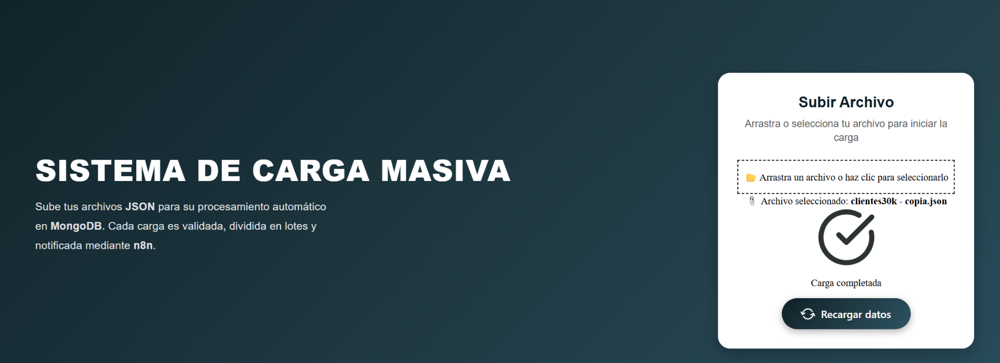
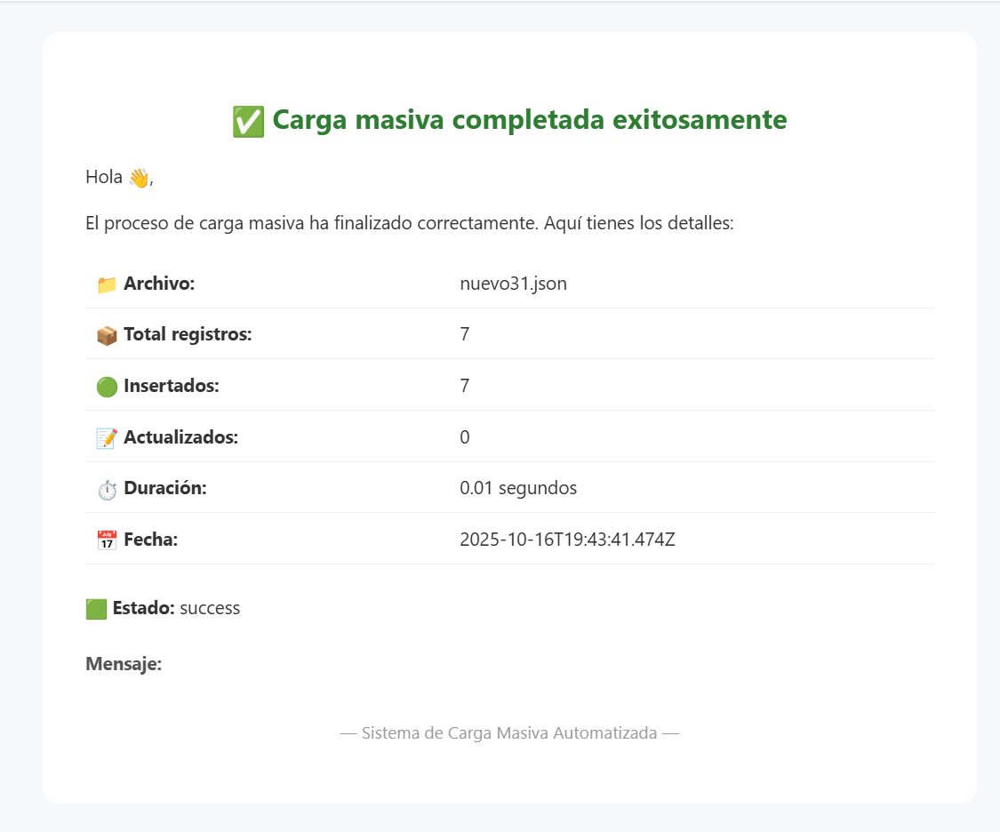
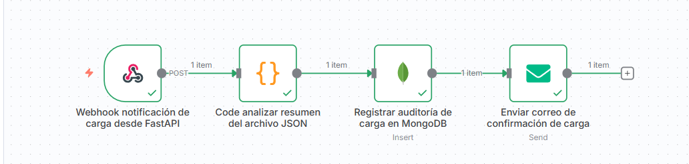

<h1 align="center">⚡ Sistema de Carga Masiva Automatizada</h1>

  <b>Frontend + Backend + Automatización con n8n</b> 
  🚀 React · FastAPI · MongoDB · n8n · Gmail API

---

## 🖼️ Vista general

  

  

---

## ✨ Descripción del proyecto

El **Sistema de Carga Masiva Automatizada** permite subir, procesar y auditar archivos JSON grandes en MongoDB, de forma simple y totalmente automática.

🧩 Flujo completo:
1. El usuario sube un archivo JSON desde el **frontend en React**.  
2. El **backend en FastAPI** valida y procesa los datos.  
3. Se notifica al flujo de **n8n** mediante un **webhook**.  
4. n8n registra la auditoría en MongoDB y envía un **correo HTML estilizado**.

---

## 🚀 Tecnologías principales

| Componente | Descripción |
|-------------|-------------|
| 🖥️ **Frontend** | React + TailwindCSS + Framer Motion |
| ⚙️ **Backend** | FastAPI (Python) |
| 🧠 **Base de datos** | MongoDB |
| 🤖 **Automatización** | n8n |
| 📬 **Correo** | Gmail SMTP / API |

---

## 📸 Capturas del proyecto

### 💻 Interfaz principal

  

### 📨 Correo de notificación

  

### ⚙️ Flujo n8n

  

---

## 🌟 Características principales

✅ Subida de archivos JSON con interfaz moderna.  
✅ Inserción masiva en MongoDB con validación automática.  
✅ Auditoría completa de cada carga.  
✅ Envío de correo HTML con detalles de la carga.  
✅ Integración fluida entre React, FastAPI y n8n.

---

## 📜 Autor

**Wilson Bedoya J.**  
💼 Desarrollador Full Stack  
📧 [wilson.bedoyajs@gmail.com](mailto:wilson.bedoyajs@gmail.com)  
🌐 Proyecto personal de automatización y backend inteligente.  

---

